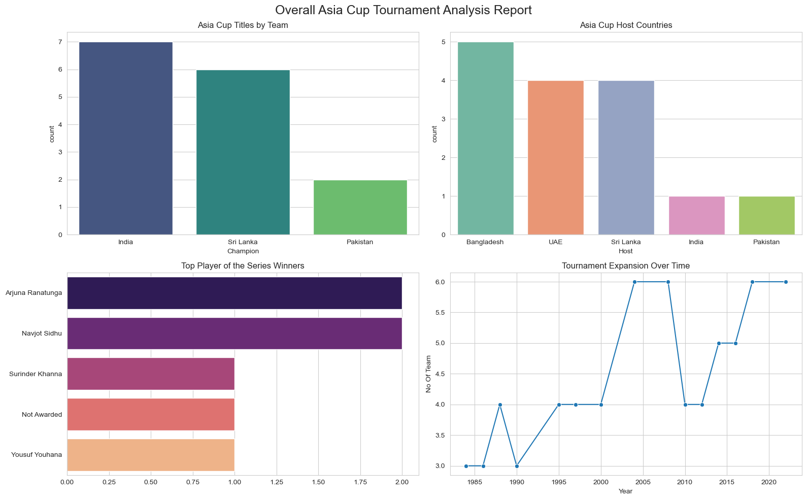
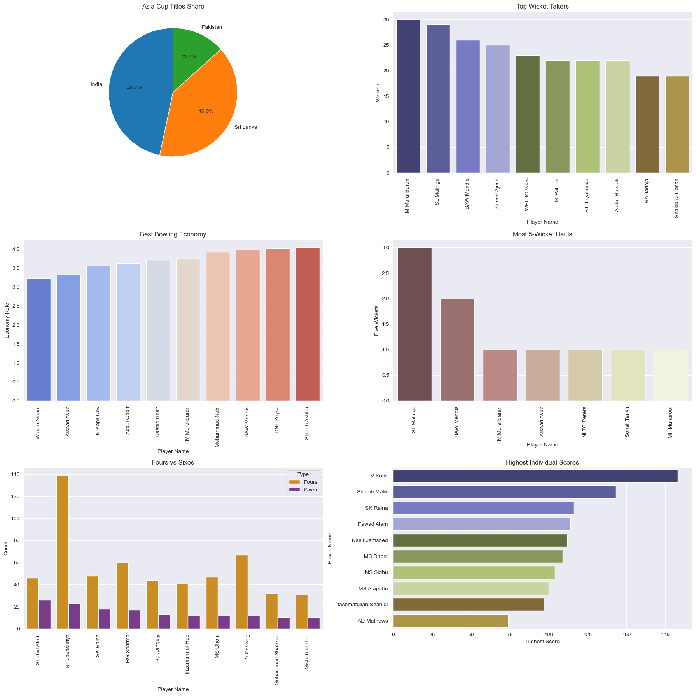

## Asia Cup Cricket Tournament Data Analysis Report 
1. `Introduction` 
Cricket is one of the most popular sports in the world, especially in Asia where tournaments 
such as the Asia Cup bring together top cricketing nations. Analyzing historical match data can 
provide valuable insights into team performance, player statistics, and tournament trends. 
This project focuses on analyzing cricket tournament data to understand team dominance, 
player performance, and historical patterns in the Asia Cup and related competitions. Using 
Python and data visualization techniques, meaningful insights were extracted from multiple 
datasets. 
2. `Problem Statement` 
The objective of this project is to analyze cricket tournament data in order to uncover key 
insights about: 
• Which teams have been the most successful historically. 
• Which batsmen have the best performance based on metrics such as batting average 
and highest score. 
• Which players dominate in terms of boundaries (fours and sixes). 
• Which bowlers perform best based on wickets, economy rate, and five-wicket hauls. 
• Which countries have hosted the tournament most frequently. 
• Which teams most frequently reach finals as champions or runner-ups. 
By performing exploratory data analysis and visualization, the goal is to transform raw cricket 
data into clear insights that help understand team dominance and player performance. 

3. `Dataset Description`
Multiple datasets were used in this project to analyze different aspects of cricket tournaments. 
1. Asia Cup Dataset 
This dataset contains historical information about Asia Cup matches including teams, match 
outcomes, and tournament details. 
Key columns include: 
• Match details 
• Participating teams 
• Match results 
• Tournament year 
• etc 
2. Champions Dataset 
This dataset contains historical information about tournament winners and runner-ups. 
Key columns: 
• Champion 
• Runner Up 
• Host Country 
• etc 
3. Batsman Statistics Dataset 
This dataset provides batting statistics for various players. 
Important features include: 
• Player Name 
• Batting Average 
• Highest Score 
• Number of Fours 
• Number of Sixes 
• etc 
4. Bowler Statistics Dataset 
This dataset contains bowling performance statistics. 
Important features include: 
• Player Name 
• Wickets 
• Economy Rate

4. `Data Preprocessing` 
Before performing analysis, several preprocessing steps were applied to ensure data quality and 
consistency. 
Handling Missing Values 
The datasets were examined for missing values. Missing values were mainly found in the Asia 
Cup dataset, while other datasets were mostly complete. 
Data Cleaning 
Basic cleaning operations were performed such as: 
• Checking column consistency 
• Removing unnecessary fields 
• Ensuring correct data types 
`Data Integration` 
Some datasets were merged to allow cross-analysis between tournaments and match results. 
These preprocessing steps ensured that the datasets were ready for analysis and visualization. 

5. `Exploratory Data Analysis` (EDA) 
Exploratory Data Analysis was conducted to understand patterns in the data. Several 
visualizations were created using Matplotlib and Seaborn. 
The analysis focused on three major areas: 
• Team performance 
• Batsman performance 
• Bowler performance 
Bar charts and count plots were used to highlight top-performing players and teams.

6. Key Insights 
1. `Teams with the Most Tournament Wins` 
Analysis of tournament winners revealed that a few teams dominate the competition. Certain 
teams have consistently performed better and won the Asia Cup multiple times, highlighting 
their strong cricketing history. 
This insight helps identify the most successful cricket teams in the tournament's history.

2. `Players with the Highest Batting Average` 
Batting average is one of the most important metrics used to evaluate batsmen performance. 
The visualization showed the players with the highest batting averages, indicating the most 
consistent run scorers in the tournament. 
Players with higher averages demonstrate reliability and strong batting performance across 
multiple matches. 
3. `Players with the Highest Individual Scores` 
The highest score analysis highlights players who have produced exceptional individual 
performances. 
These players achieved the highest runs in a single match, demonstrating their ability to 
dominate bowling attacks.

4. `Boundary Hitters (Fours and Sixes) `
Another important metric analyzed was the number of fours and sixes hit by players. 
Players with the highest number of boundaries are typically aggressive batsmen who contribute 
to fast scoring rates. These players often play a crucial role in accelerating the team's total.

4. `Boundary Hitters (Fours and Sixes`) 
Another important metric analyzed was the number of fours and sixes hit by players. 
Players with the highest number of boundaries are typically aggressive batsmen who contribute 
to fast scoring rates. These players often play a crucial role in accelerating the team's total.

6. `Bowlers with the Most Wickets` 
Wickets are the most important metric for bowlers. 
The analysis identified bowlers who have taken the highest number of wickets in the dataset, 
highlighting the most effective wicket-taking bowlers. 
These bowlers play a major role in breaking partnerships and turning matches.
6. `Bowlers with the Most Wickets` 
Wickets are the most important metric for bowlers. 
The analysis identified bowlers who have taken the highest number of wickets in the dataset, 
highlighting the most effective wicket-taking bowlers. 
These bowlers play a major role in breaking partnerships and turning matches.

9. `Tournament Host Countries` 
The analysis also examined which countries have hosted the Asia Cup most frequently. 
This helps understand the geographical distribution of the tournament and the role of different 
cricket boards in organizing it. 

7. `Conclusion` 
This project analyzed historical cricket tournament data to uncover insights related to team 
performance, batting statistics, and bowling performance. 
Key findings include: 
• Identification of the most successful teams in the tournament. 
• Recognition of top-performing batsmen based on average and highest scores. 
• Analysis of aggressive players based on boundary counts. 
• Identification of the most effective bowlers based on wickets, economy rate, and five
wicket hauls. 
• Understanding of tournament hosting trends. 
Through the use of Python, Pandas, Matplotlib, and Seaborn, raw cricket data was transformed 
into meaningful visual insights. 
This analysis demonstrates how data science techniques can be applied to sports analytics to 
better understand performance patterns and historical trends.